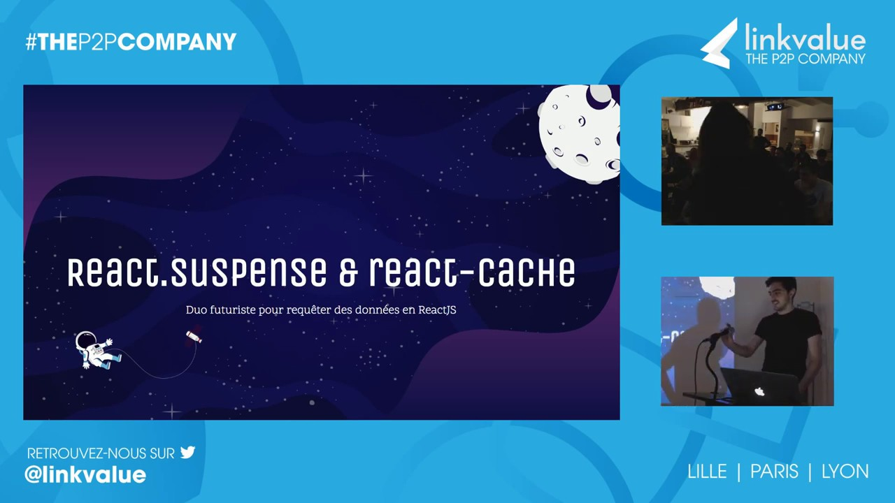

J'ai eu l'occasion de donner mon premier talk lors d'un meetup ReactJS de linkvalue. 
Je parle de React.Suspense et du futur package react-cache.

> Vous pouvez revoir mon talk avec <a href="http://www.youtube.com/watch?v=lc3bLbR4wPY" title="Cliquez pour voir la rediffusion de mon talk" target="_blank" rel="noopener noreferrer">ce replay</a>

> Pour voir les slides, ça se passe sur <a href="https://speakerdeck.com/florentbarriol/react-dot-suspense-and-react-cache" title="Cliquez pour les slides de mon talk" target="_blank" rel="noopener noreferrer">Speaker Deck</a>.

Pour voir le code de la démo, ça se passe sur ce [dépôt github](https://github.com/florentbarriol/demo-talk-react-suspense).
N'hésitez pas à créer une issue si trouvez un bug sur la démo ou à me contacter si vous avez une question

Ce fut une très bonne première expérience pour un premier talk. J'essaierai de recommencer dès que j'en aurais l'occasion ou que je souhaiterai partager un sujet.